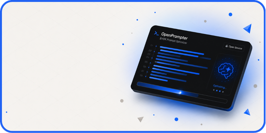
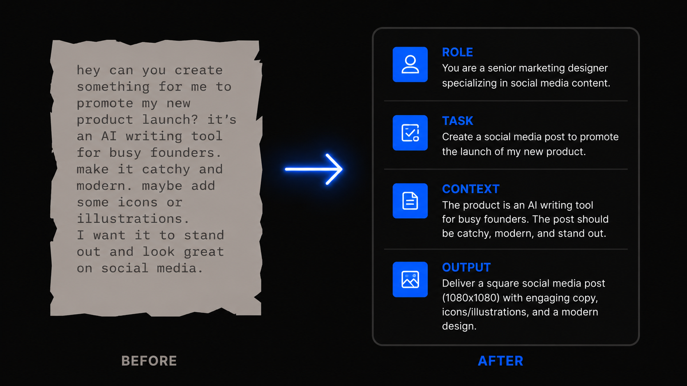
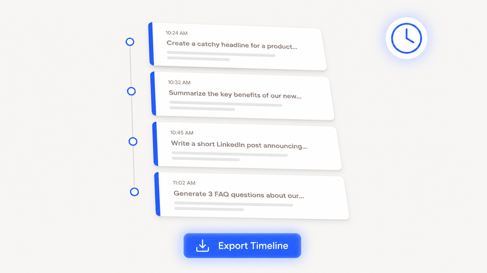
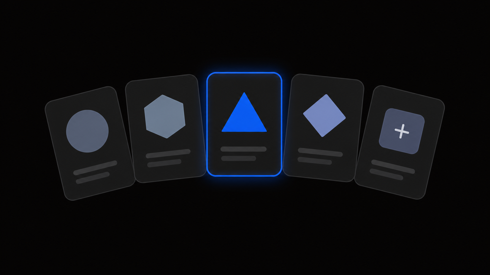

<div align="center">


# OpenPrompter

**Open-source AI prompt optimizer. Bring your own key. Zero limits. Zero middlemen.**

<p align="center">
<a href="https://github.com/Owie6789/OpenPrompter/blob/main/LICENSE"></a>
<a href="https://github.com/Owie6789/OpenPrompter/releases"></a>


</p>



</div>

<br>

##  **What is OpenPrompter?**

Most prompt optimizer tools are paywalled, rate-limited, or quietly logging your ideas. **OpenPrompter is none of those things.**

You paste a rough prompt. OpenPrompter — using **your own API key** from OpenAI, DeepSeek, Anthropic, or any compatible provider — deconstructs it, restructures it into a framework of Role / Task / Context / Constraints / Output, and hands you back something an LLM actually parses well.

Your key. Your data. Your prompts. That's it.

> ** Privacy Guarantee:** No accounts. No subscriptions. No server-side prompt logging. Keys live in your browser's local storage only.

<br>

##  **Built With**

<p align="left">


</p>

<br>

##  **Core Features**

###  **Prompt Optimization Workspace**

<p align="center">

</p>

Paste any rough draft — a story idea, a code request, a marketing brief. Select an expert persona, pick your model, add optional constraints, and hit **Optimize** (or `Ctrl + Enter`).

The engine deconstructs your input and outputs a structured, high-clarity prompt with:
* **Confidence Score:** How well-formed the output is.
* **Structural Improvements:** What changed and why.
* **Applied Architectures:** Labelled techniques used.
* **Export Options:** Copy as plain text, Markdown, or raw JSON.

---

###  **BYOK — Bring Your Own Key**

<p align="center">

</p>

Plug in your own API key from any supported provider. OpenPrompter routes your prompt directly from browser → your key → provider API. No intermediary, no logging.

<div align="center">

| Provider | Default Endpoint | Key Format |
|:---:|:---:|:---:|
| **OpenAI** | `https://api.openai.com/v1` | `sk-...` |
| **DeepSeek** | `https://api.deepseek.com/v1` | `sk-...` |
| **Anthropic** | `https://api.anthropic.com/v1` | `sk-ant-...` |
| **Custom** | Any OpenAI-compatible URL | Your format |

</div>

*After saving, OpenPrompter **auto-fetches your available models** and displays them in a live-scrolling marquee.*

---

###  **Curated Prompt Templates**

<p align="center">

</p>

6 high-fidelity starter templates spanning:
* **Coding:** Refactor, review, architect.
* **Marketing:** Copy, campaigns, positioning.
* **Analysis:** Research synthesis, data breakdowns.
* **Sales:** Outreach, objection handling.
* **Education:** Lesson plans, explanations.
* **Product:** PRDs, user stories, roadmaps.

Filter by category or search by keyword. One click loads any template directly into the workspace.

---

###  **Custom Personas** &  **Local History**

<p align="center">

</p>

* **Personas:** Design your own expert AI roles (e.g., *"Python Refactoring Ninja"*). Personas persist across sessions via localStorage and apply as system-level instructions. 5 presets included.
* **History:** Every optimization is saved locally with full metadata (score, type, timestamp, model). Export your session as JSON/Markdown, or wipe it clean in one click.

<br>

##  **Quick Start**

```bash
# 1. Clone the repository
git clone https://github.com/Owie6789/OpenPrompter.git
cd OpenPrompter

# 2. Install dependencies
npm install

# 3. Start the development server
npm run dev
